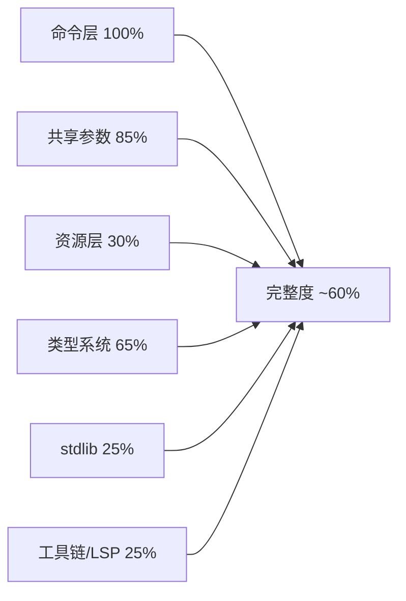

# Mclang 距「完整 MC 数据包编程语言」差距评估

**总评：约 60%。** 命令层已基本封顶，差的是**资源 JSON 层、包容器、类型系统、工具链**三块。

## 各层完成度

| 层 | 完成度 | 现状 |
|---|---|---|
| **命令结构化** | **100%** | 68/68 命令族；`build/monster_market` 798 条命令、0 处 `run "..."` 逃生口，实测成立 |
| **共享参数** | 85% | 选择器/NBT/SNBT/TextComponent/坐标/方块状态/粒子较完整；物品组件与谓词「部分」 |
| **语言与类型** | 65% | 控制流/模块/宏/上下文检查很强；但运行时只有 `i32 计分` 一种值 |
| **数据包资源** | **30%** | 55 种资源类型可输出，但字段级校验只覆盖 predicate/recipe/loot_table/tags |
| **stdlib** | 25% | 仅 `math/state/time/random` 4 模块 17 函数 |
| **工具链** | 20% | 有 `build/check/lsp` 与可复现 ZIP；仍无 fmt/init/test/项目配置 |
| **LSP** | 35% | 有补全/悬停/跳转/诊断；无引用/重命名/签名/符号/语义高亮 |

## 关键差距（按优先级）

### 阻塞级 — 不补就不算「完整」

1. **资源 schema 90% 是透传**：`src/compiler/validate/resource_schema.rs:22` 的 `_ => {}` 让 `dialog`、`item_modifier`、`enchantment`、`trade_set`、`dimension`、全部 `worldgen/*` 等 50+ 类型零校验
2. **loot_table / item_modifier / predicate / recipe / dialog 无类型化 DSL**，全是 `resource 名 = """JSON"""` 字符串（`src/ast/declarations.rs:227`）——命令结构化了，资源没结构化
3. **advancement conditions 是 raw JSON**，数据包最重要的事件入口未类型化
4. **类型系统只有 `Value::Integer(i32) | Score`**（`src/compiler/codegen/mod.rs`）：无 bool/float/字符串/`const`/多返回值。`examples/portable_chest/PLAN.md` 里「放弃物品 NBT 往返」就是被这个逼出来的

### 重大

| # | 差距 | 位置 |
|---|---|---|
| M1 | `schedule` 不能带参数/宏实参 | `src/ast/statements.rs:156` |
| M2 | 宏辅助函数转发仍依赖生成命令文本的后处理，分数不能直接当宏实参 | `src/compiler/codegen/macros.rs` |
| M3 | 单版本硬编码 26.3，无多版本 | `src/version/snapshot.rs` |
| M4 | 无 source map / `--emit` 调试 | `DEVELOPMENT_PLAN.md` |
| M5 | stdlib 缺 9 个模块（debug/test/storage/entity/inventory/text/world/collections/fixed） | `src/stdlib.rs` |
| M6 | 无项目配置文件、无本地库根 | `DEVELOPMENT_PLAN.md` |

### 次要

- `__mcl` 辅助函数仍占一定比例，但单命令 `if` 已内联；当前 monster_market 为 66 个 mcfunction，其中 24 个位于 `__mcl`（约 36%）
- 运行期整数除/模仍完全沿用计分板语义；常量除零与溢出已有诊断；item 组件/谓词字段只覆盖常用子集
- MessageArgument 带选项的选择器被拒绝；structure `.nbt` 只字节复制不校验
- 工具链与 LSP 清单（`DEVELOPMENT_PLAN.md` §6-§7）整体未动工

## 建议冲刺顺序

1. **统一资源 schema IR**（一份 26.3 codec → 字段校验 + 类型化 DSL 骨架），先打 `loot_table` / `item_modifier` / `predicate`（三者共用 loot function 模型），再 `advancement conditions`、`dialog`
2. **类型系统最小增强**：加入 `const`、一等布尔值，以及多返回值（或元组），减少为表达常量、条件和多个结果而手写的计分板代码。
3. 之后再做 stdlib 扩展、项目配置、source map、LSP 完善

## 已落实的核对项

- 包容器已支持：`assets/pack.mcmeta` 可提供 `supported_formats`、`overlays`、`filter`、`features` 等完整元数据，`assets/pack.png` 会被校验并复制，`assets/overlays/<目录>/` 会保留目录布局。
- `mclang build --zip` 已可直接生成根目录正确、字节可复现的数据包 ZIP。
- 无控制转移的单命令 `if` 分支会直接生成 `execute ... run <命令>`，不再创建只含一条命令的辅助函数。
- 常量整数的加减乘除、取模和取负会在编译期诊断除零与 i32 溢出，不再悄悄退化为运行期计分板运算。

一句话：**作为「写命令的语言」已经完工，作为「写数据包的语言」还差资源层这一整个维度。** 优先攻资源 schema，大概能把整体从 60% 拉到 80%+。
